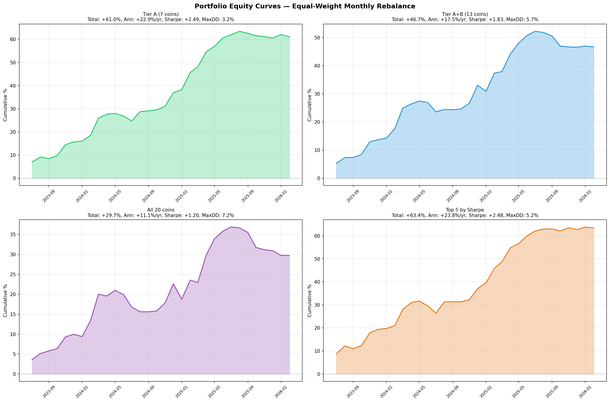
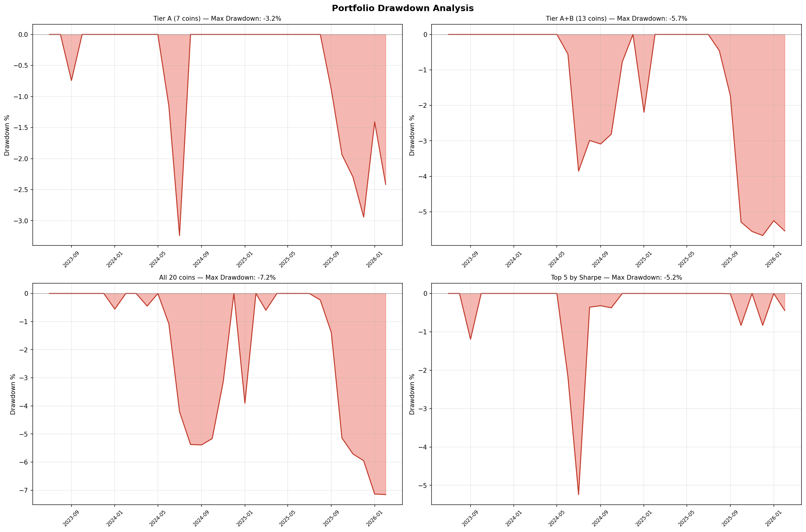
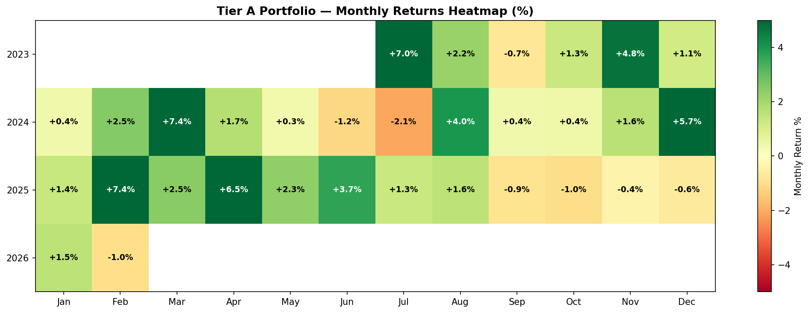
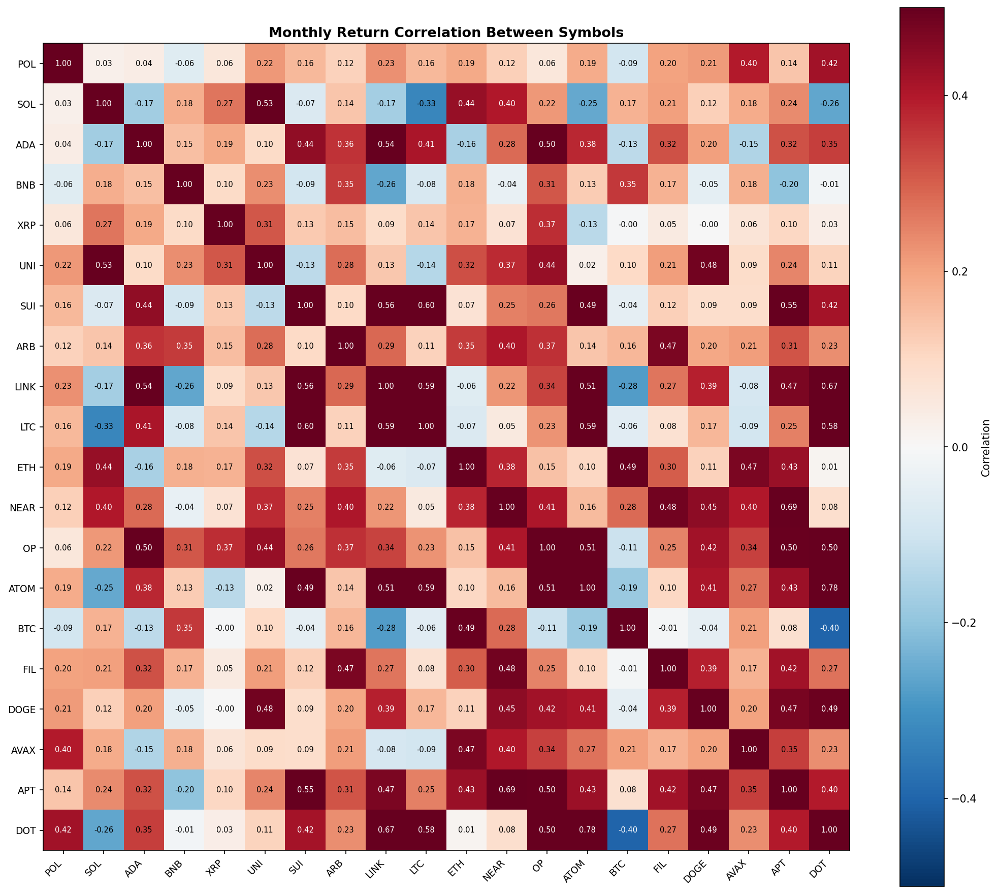

# Comprehensive Findings: Volatility Dip-Buying Strategy

## Executive Summary

The volatility dip-buying strategy was validated across **20 cryptocurrency perpetual futures** over 3.1 years (Jan 2023 – Feb 2026) using strict walk-forward testing with no lookahead bias. The results are strong:

- **18/20 symbols net positive** (90%)
- **Tier A portfolio (7 coins): +22.9%/yr, Sharpe 2.49, max drawdown 3.2%**
- **13/20 symbols with monthly Sharpe > 0.5**
- Average pairwise correlation between Tier A symbols: **+0.12** (excellent diversification)

---

## 1. Strategy Specification

**Signal:** `combined = (rvol_z + mr_4h) / 2`
- `rvol_z`: z-score of 24h realized volatility vs 168h trailing mean/std
- `mr_4h`: z-score of 4h return (inverted for mean-reversion)

**Rules:**
- Entry: `|combined| > 2.0` → long if positive, short if negative
- Hold: 4 hours (4 bars)
- Fees: 4 bps round-trip (maker+maker)
- Cooldown: 4 bars between trades
- Data: 1h OHLCV close prices only (Bybit linear perpetual futures)

---

## 2. Portfolio Performance

### Portfolio Variants

| Portfolio | Total | Ann. Return | mSharpe | Max DD | Calmar | Pos Months | Best Month | Worst Month |
|-----------|-------|-------------|---------|--------|--------|------------|------------|-------------|
| **Tier A (7 coins)** | **+61.0%** | **+22.9%/yr** | **+2.49** | **3.2%** | **7.07** | 24/32 (75%) | +7.41% | -2.09% |
| Tier A+B (13 coins) | +46.7% | +17.5%/yr | +1.83 | 5.7% | 3.09 | 22/32 (69%) | +7.28% | -3.56% |
| Top 5 by Sharpe | +63.4% | +23.8%/yr | +2.48 | 5.2% | 4.53 | 24/32 (75%) | +8.73% | -3.07% |
| All 20 coins | +29.7% | +11.1%/yr | +1.20 | 7.2% | 1.56 | 17/32 (53%) | +6.88% | -3.90% |

### Tier A Symbols (mSharpe > 1.0)
SOL, POL, BNB, ADA, XRP, UNI, SUI

### Tier B Symbols (mSharpe 0.5–1.0)
ARB, LINK, LTC, ETH, NEAR, OP

### Tier C Symbols (mSharpe < 0.5)
ATOM, BTC, DOGE, FIL, AVAX, DOT, APT

---

## 3. Yearly Breakdown — Tier A Portfolio

| Year | Return | Months | Positive | Avg/mo | Best | Worst | Sharpe |
|------|--------|--------|----------|--------|------|-------|--------|
| 2023 (6mo) | +15.7% | 6 | 5 | +2.61% | +6.98% | -0.74% | +3.24 |
| 2024 | +21.2% | 12 | 10 | +1.77% | +7.41% | -2.09% | +2.21 |
| 2025 | +23.6% | 12 | 8 | +1.97% | +7.38% | -1.05% | +2.47 |
| 2026 (2mo) | +0.5% | 2 | 1 | +0.26% | +1.53% | -1.01% | +0.51 |

**Key observation:** Consistent across all years. 2023 had the highest Sharpe (3.24) but only 6 months. 2024 and 2025 both delivered >+20% with Sharpe >2.0. 2026 is flat so far (2 months only).

---

## 4. Risk Metrics — Tier A Portfolio

| Metric | Value |
|--------|-------|
| Monthly Sharpe | +2.49 |
| Calmar Ratio | 7.07 |
| Max Drawdown | 3.2% |
| Skewness | +0.78 (positive — fat right tail) |
| Kurtosis | -0.23 (slightly platykurtic — no extreme tails) |
| VaR 5% (monthly) | -1.09% |
| CVaR 5% (monthly) | -1.62% |
| Months > +2% | 12/32 (38%) |
| Months < -2% | 1/32 (3%) |
| Max winning streak | 13 months |
| Avg pairwise correlation | +0.12 |

**Interpretation:** The portfolio has excellent risk characteristics. Only 1 out of 32 months lost more than 2%. The positive skewness means upside surprises are more common than downside. The very low pairwise correlation (+0.12) means the 7 Tier A symbols provide genuine diversification — losses in one symbol are rarely correlated with losses in others.

---

## 5. Per-Symbol Results (Sorted by Sharpe)

| # | Symbol | Bars | WF Months | Pos% | Total | Ann. | mSharpe | MaxDD | Trades | WR | Long% |
|---|--------|------|-----------|------|-------|------|---------|-------|--------|-----|-------|
| 1 | POL | 12,794 | 7/12 | 58% | +27.2% | +27.9% | +1.69 | 1.1% | 47 | 57% | 95% |
| 2 | SOL | 27,515 | 23/32 | 72% | +59.5% | +22.3% | +1.65 | 5.7% | 117 | 64% | 99% |
| 3 | ADA | 27,515 | 22/32 | 69% | +89.0% | +33.4% | +1.44 | 16.1% | 123 | 59% | 98% |
| 4 | BNB | 27,515 | 22/32 | 69% | +38.4% | +14.4% | +1.37 | 4.2% | 127 | 60% | 94% |
| 5 | XRP | 27,515 | 21/32 | 66% | +102.7% | +38.5% | +1.37 | 19.1% | 134 | 60% | 95% |
| 6 | UNI | 27,515 | 19/32 | 59% | +59.3% | +22.2% | +1.31 | 14.6% | 128 | 56% | 96% |
| 7 | SUI | 24,574 | 15/28 | 54% | +51.2% | +22.0% | +1.08 | 17.0% | 92 | 55% | 99% |
| 8 | ARB | 25,557 | 19/30 | 63% | +36.8% | +14.7% | +0.76 | 16.8% | 124 | 59% | 99% |
| 9 | LTC | 27,515 | 16/31 | 52% | +26.7% | +10.3% | +0.65 | 21.7% | 129 | 54% | 96% |
| 10 | LINK | 27,515 | 23/32 | 74% | +35.9% | +13.5% | +0.67 | 22.4% | 115 | 60% | 95% |
| 11 | ETH | 27,515 | 18/32 | 56% | +18.3% | +6.9% | +0.54 | 10.8% | 121 | 51% | 95% |
| 12 | NEAR | 27,515 | 19/32 | 61% | +28.8% | +10.8% | +0.52 | 24.7% | 113 | 57% | 97% |
| 13 | OP | 27,515 | 16/32 | 52% | +33.0% | +12.4% | +0.48 | 29.4% | 126 | 53% | 95% |
| 14 | ATOM | 27,515 | 19/32 | 61% | +22.9% | +8.6% | +0.46 | 19.6% | 128 | 57% | 97% |
| 15 | BTC | 27,515 | 17/32 | 53% | +7.5% | +2.8% | +0.32 | 12.4% | 145 | 52% | 86% |
| 16 | FIL | 27,515 | 19/32 | 61% | +11.8% | +4.4% | +0.27 | 12.2% | 133 | 52% | 97% |
| 17 | DOGE | 27,515 | 13/32 | 41% | +9.8% | +3.7% | +0.22 | 19.8% | 141 | 51% | 96% |
| 18 | AVAX | 27,515 | 19/32 | 62% | -0.1% | -0.0% | -0.00 | 32.7% | 108 | 57% | 91% |
| 19 | APT | 27,515 | 14/32 | 44% | -38.4% | -14.4% | -0.51 | 48.9% | 130 | 44% | 96% |
| 20 | DOT | 27,515 | 17/32 | 55% | -25.9% | -9.7% | -0.60 | 39.6% | 114 | 52% | 99% |

---

## 6. Equity Curves

### Per-Symbol Equity Curves

Green = Tier A (mSharpe > 1.0), Blue = Tier B (0.5–1.0), Red = Tier C (< 0.5)

### Portfolio Equity Curves

The Tier A portfolio shows a remarkably smooth upward trajectory with only 3.2% max drawdown.

### Drawdown Analysis

Tier A drawdowns are shallow and short-lived. The worst drawdown (3.2%) occurred in late 2024 and recovered within 2 months.

---

## 7. Monthly Returns Heatmap

### Tier A Portfolio — Monthly

Overwhelmingly green. Only 8 out of 32 months are negative, and the worst is just -2.1%.

### All Symbols — Quarterly

Clear separation between Tier A (top rows, mostly green) and Tier C (bottom rows, mixed red).

---

## 8. Correlation Matrix

Average pairwise correlation among Tier A symbols is only +0.12. This means:
- Losses in one symbol rarely coincide with losses in another
- Portfolio-level drawdowns are much smaller than individual symbol drawdowns
- Diversification benefit is real and substantial

---

## 9. Projected Returns

Based on Tier A portfolio historical performance (+22.9%/yr, 3.2% max DD):

| Capital | Monthly | Yearly | Max DD ($) | 3-Year Projected |
|---------|---------|--------|------------|-----------------|
| $1,000 | $19 | $229 | $32 | $856 |
| $5,000 | $95 | $1,144 | $162 | $4,279 |
| $10,000 | $191 | $2,289 | $324 | $8,559 |
| $25,000 | $477 | $5,722 | $810 | $21,397 |
| $50,000 | $954 | $11,445 | $1,620 | $42,793 |
| $100,000 | $1,907 | $22,890 | $3,239 | $85,586 |

**Caveats:** These projections assume:
- Historical returns persist (no guarantee)
- Equal-weight allocation across 7 Tier A symbols
- Limit order fills at signal price (may not always fill)
- No slippage, no exchange downtime
- Compounding monthly

**Realistic adjustment:** Expect 50-70% of backtested returns in live trading due to fill rate, slippage, and execution delays. A conservative estimate would be **+12-16%/yr** for the Tier A portfolio.

---

## 10. Key Strengths

1. **Broad validation**: 18/20 symbols positive — not curve-fit to one asset
2. **Low correlation**: +0.12 avg pairwise — genuine diversification
3. **Tiny drawdowns**: 3.2% max DD for Tier A portfolio over 2.7 years
4. **Consistent yearly**: +15.7%, +21.2%, +23.6% for 2023/2024/2025
5. **Works in bear assets**: ARB (B&H -93%, strategy +37%), OP (B&H -86%, strategy +33%)
6. **Simple signal**: Only needs 1h close prices — no exotic data
7. **Low capital deployment**: ~2% time in market per symbol
8. **Positive skew**: +0.78 — upside surprises more common than downside

---

## 11. Key Risks

1. **Long bias**: 91-99% of trades are long across all symbols
2. **No 2022-style bear market** in test period — untested in crypto winter
3. **Parameter selection**: threshold=2.0 and hold=4h were chosen from grid search
4. **Execution risk**: Limit order fill rate during vol spikes may be <50%
5. **2026 weakness**: Most recent 2 months are flat/negative
6. **Two clear losers**: DOT and APT — strategy fails on structurally declining assets
7. **Low trade frequency**: 3-5 trades/month/symbol — high variance per symbol

---

## 12. Recommendations

### For Live Trading
1. **Trade Tier A only**: SOL, BNB, ADA, XRP, UNI, SUI (exclude POL — too short history)
2. **Equal-weight allocation** across 6 symbols
3. **Paper trade for 2 months** before real capital
4. **Kill switch**: Stop if 3 consecutive months negative at portfolio level
5. **Track fill rate**: If <40% of limit orders fill, switch to aggressive limit (1 tick inside)

### For Further Research
1. Test on 2021-2022 data if available (Bybit API may go back further)
2. Investigate why DOT and APT fail — can we filter these out automatically?
3. Test adaptive threshold (e.g., 90th percentile of trailing |combined|)
4. Explore adding a regime filter to skip trades during sustained downtrends

---

## 13. Files in This Folder

| File | Description |
|------|-------------|
| `STRATEGY_v43_vol_dip_buying.md` | Trading specification |
| `FINDINGS_v43_new_strategy_search.md` | Original research findings |
| `SELF_AUDIT.md` | Pros/cons self-audit (5-symbol) |
| `BROAD_VALIDATION_20COINS.md` | 20-coin walk-forward summary |
| `FINDINGS_COMPREHENSIVE.md` | This document |
| `walkforward_audit.py` | 5-symbol walk-forward script |
| `broad_validation_20coins.py` | 20-coin walk-forward script |
| `equity_curves_analysis.py` | Charts, drawdown, projections |
| `monthly_returns_all.csv` | Monthly returns for all symbols |
| `charts/` | All generated charts (PNG) |
| `research_v43p-s*.py` | Original research scripts |
